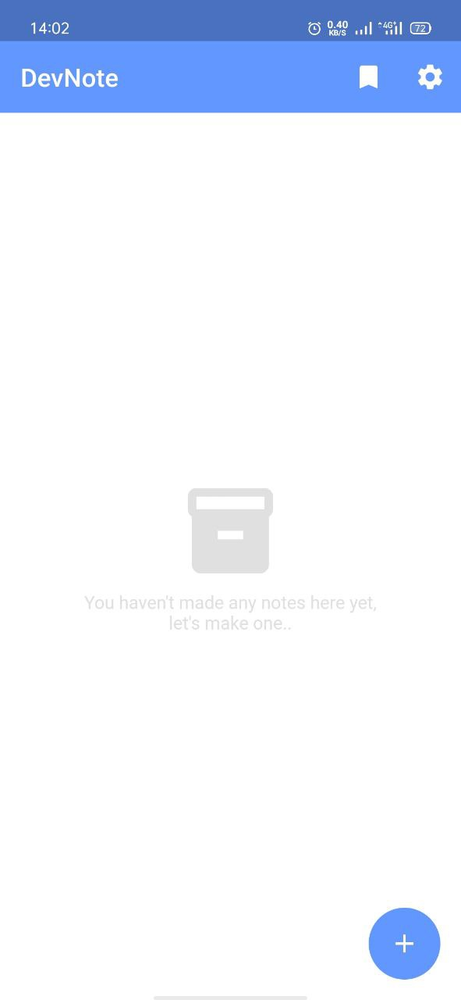
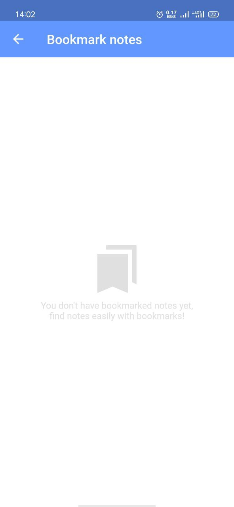
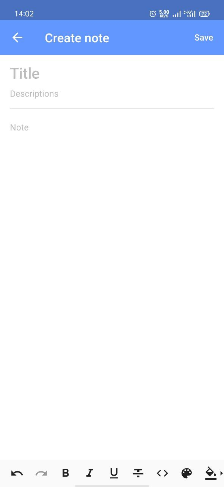
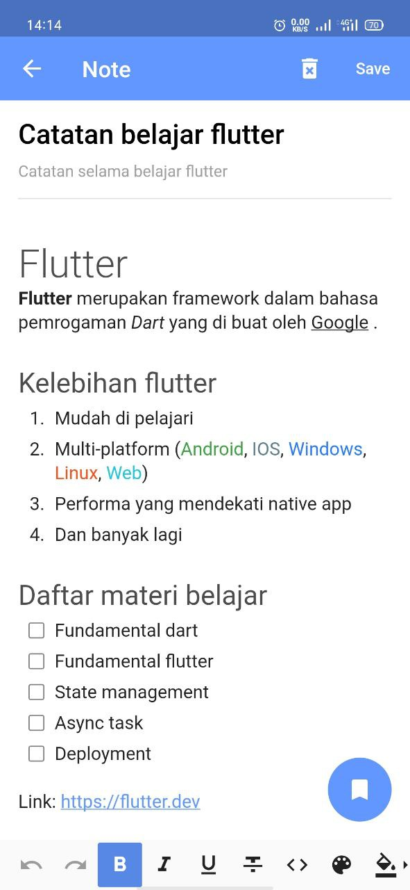
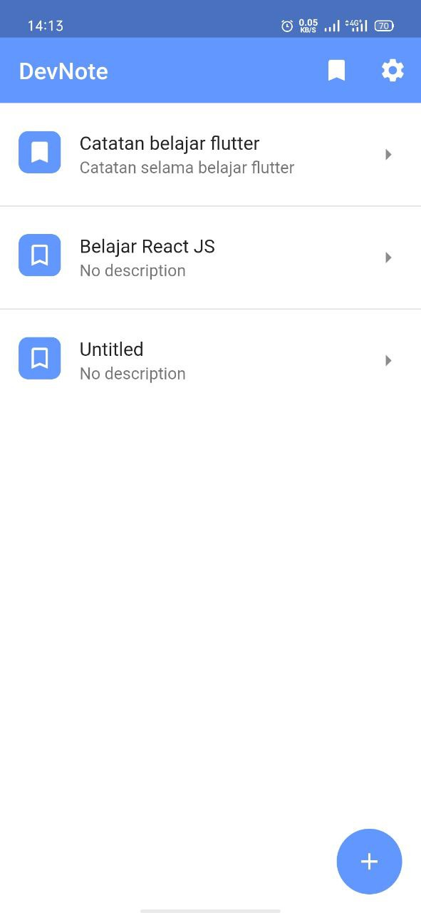
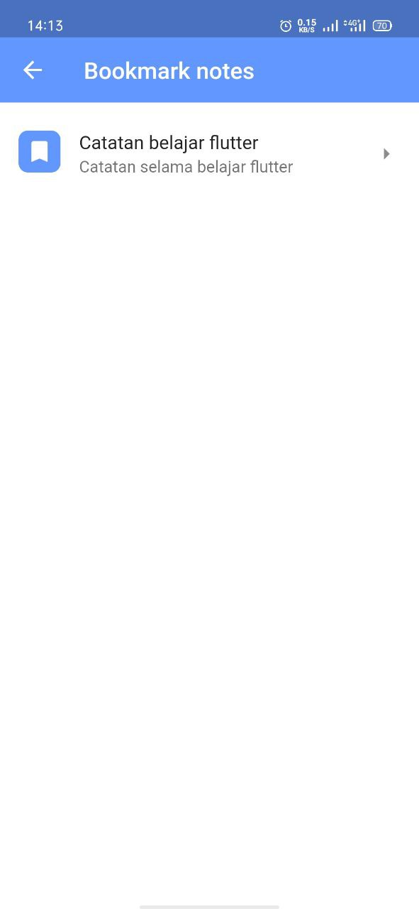
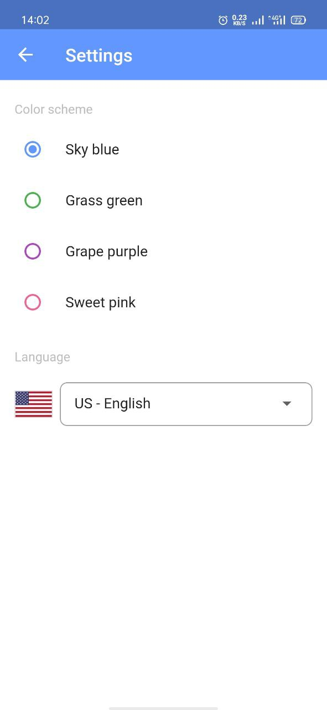
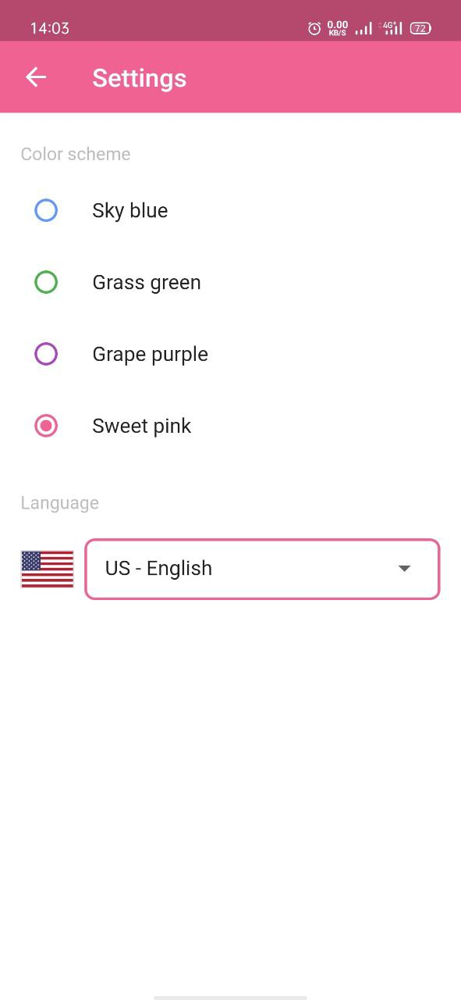
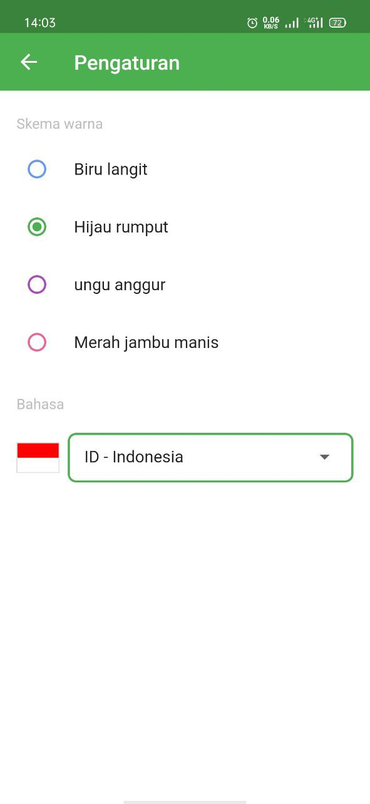

# DevNote app
DevNote (Developer Note) an notes app build with [Flutter](https://flutter.dev/)

## Features
- CRUD (Create, Read, Update, Delete) Notes in provider store
- Settings change app theme colors
- Settings change app languages (localization) (en-US, id-ID) with [easy_localization](https://pub.dev/packages/easy_localization)
- WYSIWYG Rich Text editor for create note with [flutter_quill](https://pub.dev/packages/flutter_quill)
- Bookmark and unbookmark notes
## Screenshots

  
  
  
  
  
  
  
  
  

